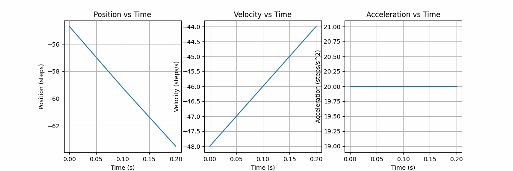
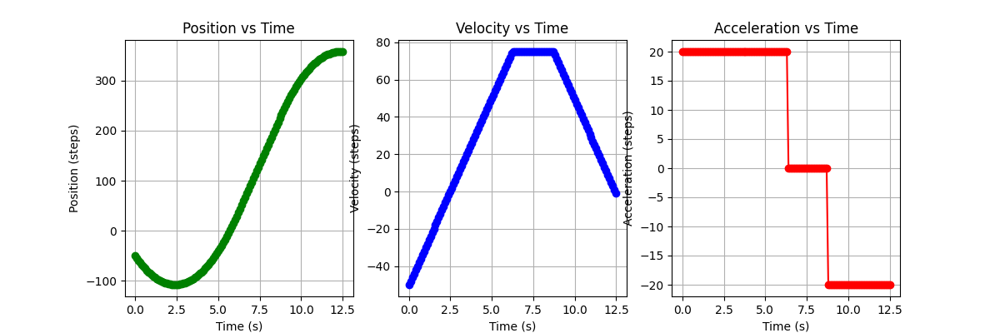
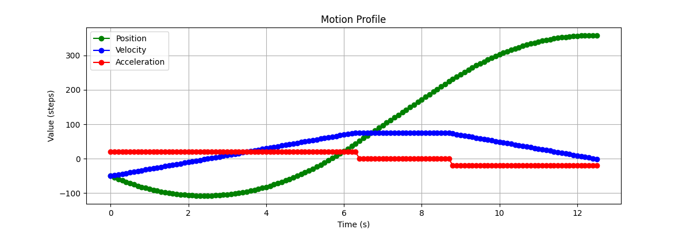

## Overview
This Stepper Controller class models how a stepper motor would be driven using a trapezoidal curve.

It calculates the time required to hit the goal position while not exceeding the max velocity and 
acceleration. It then calculates the trajectories of the position, velocity and acceleration at each time step. 
These values are logged to a .csv file and are also graphed in real time with the `receive_and_plot_real_time_values.py` script.

### Design Choices:
* This class assumes that the goal position is always positive and only handles positive goal positions.
* This class assumes that not exceeding the max velocities and max acceleration are more important than hitting the 
goal position. The other condition was that the motor should stop moving (velocity = 0) at the end of it's trajectory. 
There are some edge cases where in order to maintain those conditions, the goal position will be 
overshot or not reached.
* The python script for graphing must be run **before** the stepper motor class
* There are two constructors. 
  * One with 5 parameters`(initial_position, initial_velocity, goal_position, max_velocity, 
  max_acceleration)`. 
  * The other has 2 parameters `(inital_position, initial_velocity)`. The latter constructor needs the 
  `set_goal()` method to set the remaining values. 
  * Both use float values.
* The second constructor isn't being used because of the requirements 
  for a command line interface. However, it can be used in by making changes to `main.cpp`
* There are some tests in the tests folder.
* MotorController.cpp is a short generic abstract class.

  
### How to get this working

clone the repository
```commandline
https://github.com/ChuChuIgbokwe/stepper_motor_controller.git
```
Go to the folder you cloned this in and create a build folder
```commandline
mkdir build
```
Go to the build directory and run cmake
```commandline
cd build
```
run cmake
```commandline
cmake ..
```
Build the code
```commandline
make
```
You'll happen to open a new terminal and go the directory where you cloned this repo in.
Run the `receive_and_plot_real_time_values.py` script first
```commandline
python3 scripts/receive_and_plot_real_time_values.py
```
This will open the graphing socket and have it listening for incoming messages
In the second tab go your build directory and run
```commandline
./sim_motor --initial-pos -50 --initial-vel -50 --goal-pos 350 --max-vel 75 --max-acc 20
```
You can change those values to whatever you want. If it's not a feasible trajectory, you'll see and error message on 
screen explaining what's wrong.

This will run the Stepper Motor class and start sending messages to the python script.

This [video](/images/screen_recording.webm) shows what it should look like

## Results
Once both commands have been sent, you should be able to see the output of the motor displayed on screen


When it's done sending messages, it will display two graphs
* A subplot with each of the position, velocity and acceleration trajectories
* 

* A graph with the position, velocity and acceleration trajectories superimposed on each other
* 

